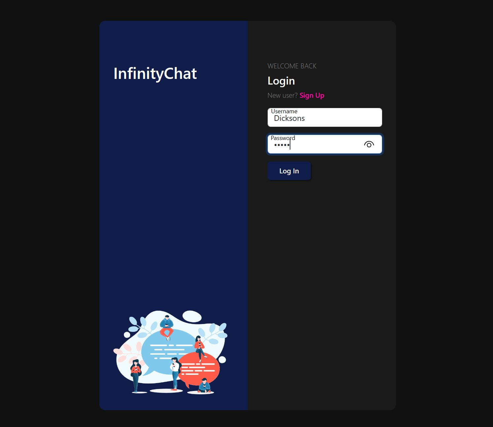

# InfinityChat

A realtime chat application built in Angular

> Angular Typescript bootstrap material responsive chat message websocket

Here is a [demo of the app](), and its [backend](https://github.com/badass-techie/InfinityChat-API).

## Features

- Create a user account
- Activate your account via email
- Login with your credentials
- Authorize with access and refresh tokens
- Message other users
- Receive messages in realtime via websockets

## Screenshots

### Signup

### Login

### Home

